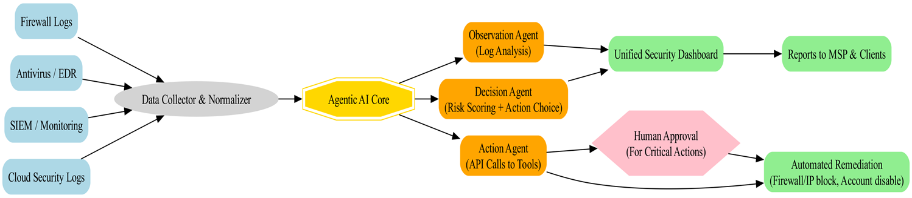

# 🧠 ZeroDaySprawl  
### **UASO – Unified AI Security Operator (Observation → Decision → Action)**  
> **AI-Powered Security Agent for MSPs & IT Teams**

---

> ⚡ *Prototype built for the SuperHack Hackathon – demonstrating how an Agentic AI can autonomously observe, decide, and act on security alerts to reduce alert fatigue and accelerate response.*

---

## 🚨 Problem Statement

Managed Service Providers (MSPs) and IT teams face **security alert sprawl** from 10+ tools — each generating noisy, redundant, and fragmented data.  
Over 70% of alerts are false positives, leading to:
- **Analyst burnout**
- **Delayed response**
- **Missed real threats**
- **Higher operational costs**

The result: *Teams are drowning in data but starving for insight.*

---

## 💡 Solution: Unified AI Security Operator (UASO)

ZeroDaySprawl acts as a **central AI security agent** that unifies, analyzes, and acts on alerts — turning chaos into clarity.

| Capability | Description |
|-------------|-------------|
| 🧩 **Unified Alert Stream** | Aggregates alerts from multiple sources into one standardized feed. |
| 🧠 **AI-Powered Analysis** | AWS Bedrock LLM classifies severity, summarizes context, and recommends next actions. |
| ⚙️ **Automated Remediation** | AWS Lambda triggers automatic fixes for low-risk issues. |
| 🧍‍♂️ **Human-in-the-Loop Escalation** | Complex or ambiguous alerts are escalated with AI-generated evidence. |
| 📊 **Audit & Transparency** | Every decision and action is logged in DynamoDB for traceability. |

---

## 🏗️ Current Prototype Scope

This prototype demonstrates the **core closed-loop triage cycle**:  
**(Observation → Decision → Action)**

✅ Alert ingestion (from JSON sample)  
✅ Bedrock-based AI analysis and triage  
✅ Alert persistence in DynamoDB  
✅ Automated SNS notification for human/auto response  
✅ Configurable via environment variables (secure and flexible setup)

---

## ☁️ AWS Architecture

**Core Components:**
- **AWS Lambda** → Core intelligence (see `security_agent_lambda.py`)
- **AWS Bedrock (Nova Lite)** → LLM-powered alert analysis & recommendations
- **Amazon DynamoDB** → Stores alert data, results, and statuses
- **Amazon SNS** → Sends escalations & action notifications

---

### 🧭 System Architecture Diagram


**Legend:**
- 🟦 Input: Log / Alert sources  
- ⚙️ Grey: Normalization layer  
- 🟨 Yellow: Agentic AI core (Observation → Decision → Action)  
- 🟩 Green: Automated actions (Dashboard, Reports, Remediation)  
- 💗 Pink: Human verification path  

> *The current build covers alert analysis and automation (core yellow + partial green zones).*

---

## 🔮 Future Roadmap (For Scalability & Extensibility)

During the demo, refer to these as “**what’s next**”:

| Focus Area | Future Implementation |
|-------------|------------------------|
| 🤖 **Adaptive Learning** | Continuous training from historical alerts and feedback. |
| 🌐 **Multi-Source Ingestion** | Integration with S3 log streams, CloudWatch, and EventBridge. |
| 📈 **Dashboard & Metrics** | Real-time analytics and AI accuracy visualization. |
| 🔁 **Automated Runbooks** | Direct remediation using AWS Systems Manager or Lambda chaining. |
| 🔒 **Governance & Explainability** | Confidence scoring, human-in-loop validation, and auditability. |

> *These make the system truly scalable, extensible, reliable, and safe.*

---

## ⚙️ How It Works

1. **Alert Ingestion** → Alerts are read line by line (from file/S3/log source).  
2. **AI Triage (Bedrock)** → LLM analyzes severity, root cause, and recommends action.  
3. **Decision Handling** → Based on AI output, Lambda decides to auto-handle or escalate.  (Real Vs False positive, AI handled vs. Human required, Generates summaries and guidance messages)
4. **Storage & Audit** → Alert data + AI reasoning saved to DynamoDB.  
5. **Notification** → SNS publishes results to respective teams.

---

## 🧾 Files

| File | Purpose |
|------|----------|
| `security_agent_lambda.py` | Main Lambda handler containing AI triage logic |
| `alerts_sample.json` | Sample alert data for demo/testing |
| `README.md` | You’re reading it :) |

---

## 🌍 Environment Variables

| Variable | Description | Example |
|-----------|-------------|----------|
| `SNS_TOPIC_ARN` | SNS topic for alert notifications | `arn:aws:sns:us-east-2:923673751301:UASO-Notifications` |
| `DDB_TABLE` | DynamoDB table name for alert data | `UASOAlerts` |
| `BEDROCK_MODEL_ID` | Model ID for AWS Bedrock | `us.amazon.nova-lite-v1:0` |
| `REGION` | AWS region | `us-east-2` |
| `ENV` | Environment tag | `Hackathon`,`Prod`,etc. |

**Note:** IAM Role must include:
- `sns:Publish`
- `dynamodb:PutItem`
- `bedrock:InvokeModel`

---
## 🚀 Deployment Steps
1. **Clone this repository**
   ```bash
   git clone https://github.com/<your-repo>/UASO.git
   cd UASO

2. **Zip and deploy the Lambda function**
    zip -r uasolambda.zip lambda_function.py alerts_sample.txt

3. **Create AWS resources (simplified)**
 - Create a DynamoDB table with AlertID as the primary key.
 - Create an SNS topic for alert notifications.
 - Set the environment variables in Lambda console.

 4. **Invoke the Lambda function**
  - You can trigger it manually (for prototype) or schedule via EventBridge.

## 🧩 Team & Impact

**Team:** *ZeroDaySprawl*  

Despite the tight timeframe, the team achieved:
- A functional prototype demonstrating **real-time AI alert triage**
- **Hands-free security handling** via AWS Bedrock & Lambda
- A scalable foundation for enterprise-ready automation

---

## 🏁 Why This Matters

This project represents a **shift from reactive to proactive security** —  
where AI agents act as co-pilots for MSPs, reducing workload and boosting defense efficiency.

**In short:**  
> *ZeroDaySprawl converts “Alert Fatigue” into “Action Confidence.”*

---

## 💬 Contact

For demo requests, technical questions, or collaboration:  
🔗 *https://www.linkedin.com/in/deepa-m-45a552166?lipi=urn%3Ali%3Apage%3Ad_flagship3_profile_view_base_contact_details%3BjXWepbqtTNKls3LFot0x%2FQ%3D%3D*
    *https://www.linkedin.com/in/harishks29?lipi=urn%3Ali%3Apage%3Ad_flagship3_profile_view_base_contact_details%3B5z83Vz%2FOQsKt7y1RXvbIIQ%3D%3D*
    *https://www.linkedin.com/in/logeshpalani33?lipi=urn%3Ali%3Apage%3Ad_flagship3_profile_view_base_contact_details%3BWPGR6Wx9SWW5eq4r1lLoSg%3D%3D*

---
